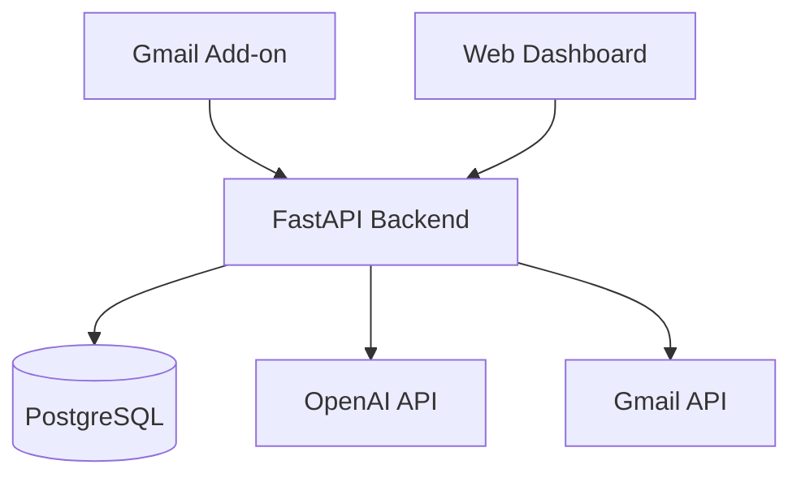

# TopRostr — System Architecture

**Version:** 0.1 | **Status:** Draft

## Overview

TopRostr will use a Python/FastAPI backend shared by two interfaces:

- **Gmail Add-on:** Process recruiting emails, review extracted information, and save recruits.
- **Web Dashboard:** View, filter, and manage saved athletes.

We'll use a modular monolith for MVP 1 to keep development and deployment simple.

## Tech Stack

| Component | Technology |
|---|---|
| Backend | Python, FastAPI |
| Gmail Integration | Google Workspace Add-on (HTTP runtime) |
| Dashboard | Jinja2, HTMX, Tailwind |
| Database | PostgreSQL, SQLAlchemy, Alembic |
| AI | OpenAI API, Pydantic |
| Testing | pytest |
| Infrastructure | Docker, GitHub Actions |

## Architecture

## Core Workflow

1. Coach opens an email and clicks **Analyze Recruit** in Gmail.
2. FastAPI retrieves the selected email using authorized Gmail access.
3. The LLM extracts athlete information into a validated Pydantic model.
4. TopRostr checks for an existing athlete record.
5. Coach reviews and confirms the extracted information.
6. The athlete is saved to PostgreSQL and becomes available in the dashboard.

## Backend Modules

- `auth` — Authentication and program-level access.
- `gmail` — Add-on requests and email retrieval.
- `extraction` — LLM processing and validation.
- `athletes` — Athlete profiles and duplicate handling.
- `recruiting` — Filtering and organization.
- `db` — Persistence and migrations.

## Key Decisions

- Email processing is manual; no continuous inbox monitoring.
- Coaches must confirm extracted information before saving.
- Missing athlete information remains unknown.
- Gmail and the dashboard share the same backend and database.
- Use minimum necessary Gmail permissions.
- Start with synthetic data and establish privacy controls before processing real athlete correspondence.
- No microservices, vector databases, or agent frameworks for MVP 1.

## Open Questions

- Gmail authorization and add-on deployment requirements.
- How to associate multiple emails with an existing athlete.
- Database schema and data retention policy.
- Hosting provider.

The Gmail integration will be validated through a small technical proof of concept before implementing the complete application.