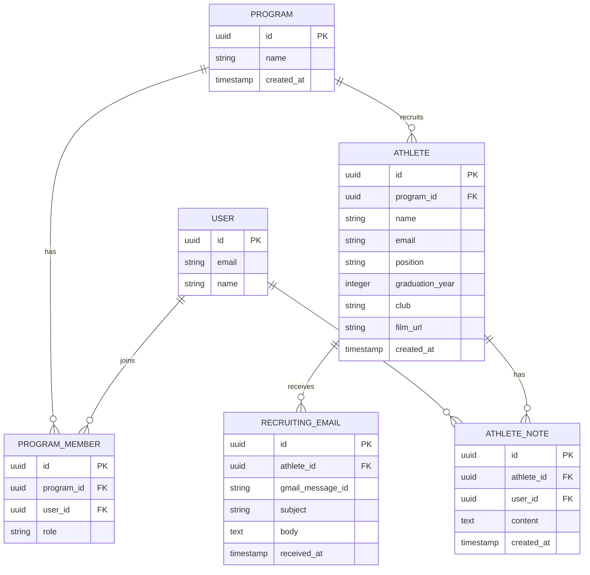

# TopRostr — Database Design

**Version:** 0.1 | **Status:** Draft  
**Database:** PostgreSQL + SQLAlchemy 2.x + Alembic

## Overview

TopRostr will use a relational database to manage college soccer programs, coaches, athletes, and recruiting correspondence.

The schema should support multiple coaches belonging to one program and multiple emails associated with one athlete.

## Entity Relationship Diagram

## Entities

| Entity | Purpose |
|---|---|
| Program | Represents a college soccer program. |
| User | Represents a TopRostr user. |
| ProgramMember | Associates coaches with their programs and roles. |
| Athlete | Stores confirmed recruiting information. |
| RecruitingEmail | Associates source correspondence with an athlete. |
| AthleteNote | Stores coach-authored notes. |

## Key Design Decisions

- Use UUIDs as primary keys.
- Athletes belong to a program, not an individual coach.
- Multiple emails can be associated with one athlete.
- Users can belong to multiple programs through ProgramMember.
- Retain the original Gmail message ID to support source traceability and prevent duplicate processing.
- Extracted athlete information must be reviewed before being saved as confirmed information.
- Use Alembic to manage schema changes.

## Open Questions

- Should full email bodies be stored, or should we retain only the Gmail message ID and necessary extracted information?
- How should athlete records with multiple email addresses be handled?
- Which athlete information requires a history of changes?
- What retention and deletion policies should apply to athlete correspondence?
